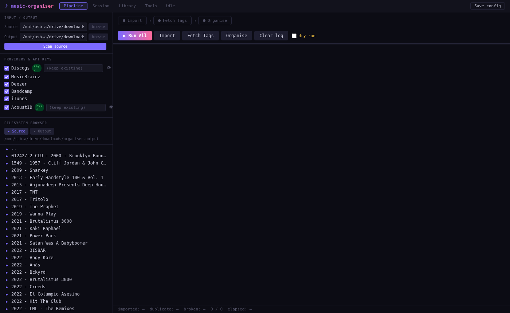
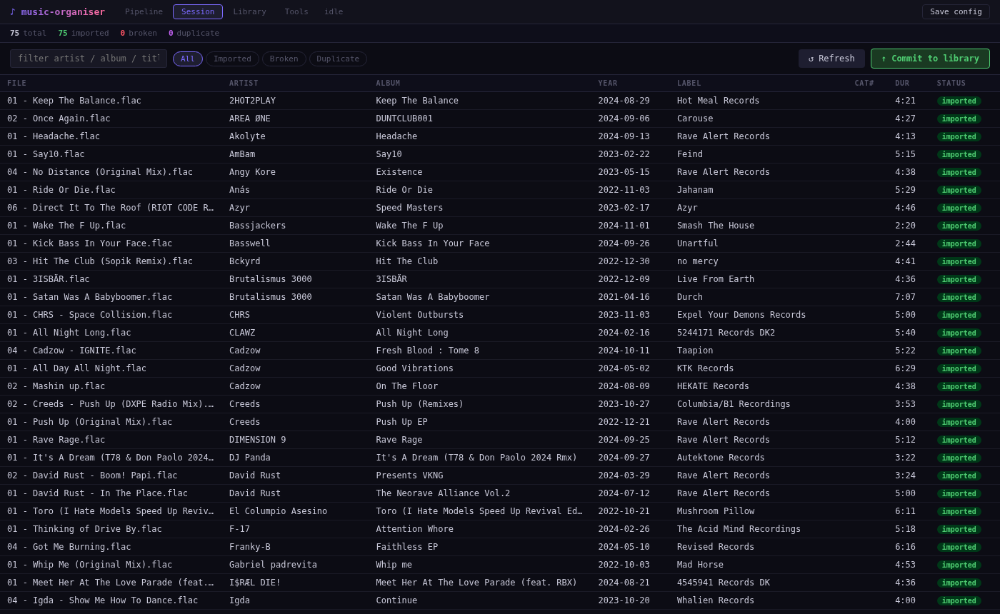
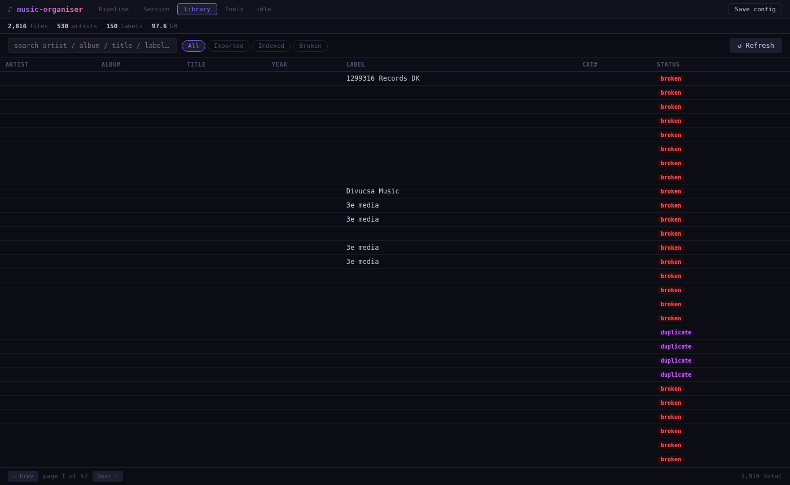
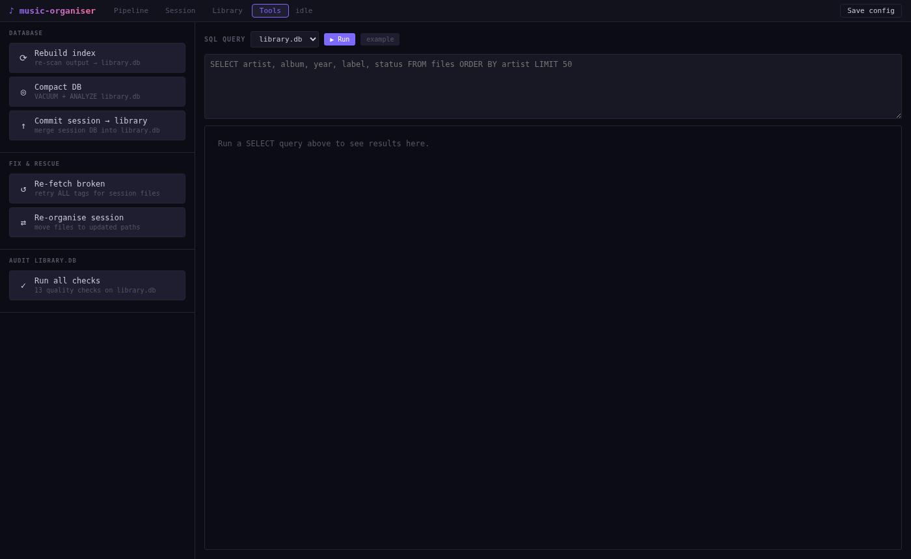

# music-organiser / 4chanRemix

Browser-based organiser for FLAC music collections.  
Imports from Nicotine+ (Soulseek), fetches metadata from Discogs / MusicBrainz / Deezer, and organises files into a clean folder layout.

---

## Screenshots

**Pipeline** — Import, fetch tags, organise in one click



**Session** — Review the current batch before committing



**Library** — Browse and search the full permanent library



**Tools** — Rebuild index, SQL query, audit checks



---

## Install (one command)

```bash
bash install.sh
```

That's it. The script checks all requirements, installs the service, and prints the URL.

If you're starting fresh and don't have the Python dependencies yet:

```bash
bash install.sh --deps
```

---

## Open the UI

After install, open your browser to the URL shown in the terminal — something like:

```
http://192.168.1.x:8082
```

The service runs in the background and auto-starts whenever you log in.

---

## Requirements

- **Python 3.10+** — check with `python3 --version`
- **Linux with systemd** for the one-command install (Ubuntu 20.04+, Debian 11+, etc.).
  The app itself also runs on **Windows** and **macOS** — see [Running on Windows](#running-on-windows).
- **fpcalc** — for AcoustID fingerprinting: `sudo apt install libchromaprint-tools`
  (Windows: drop `fpcalc.exe` from the Chromaprint release on your `PATH`)
- Internet access for metadata lookups (Discogs, MusicBrainz, etc.)

All Python packages are installed automatically when you run `bash install.sh --deps`.

---

## Control the service

```
music-organiser start      start
music-organiser stop       stop
music-organiser restart    restart (run this after any update)
music-organiser status     show URL + live stats
music-organiser logs       follow live log output
music-organiser health     JSON health check
music-organiser open       open browser (desktop only)
music-organiser enable     auto-start on login
music-organiser disable    remove auto-start
```

Or use make:

```
make start
make stop
make restart
make logs
make status
```

---

## First-time setup

1. Run `bash install.sh`
2. Open the browser URL
3. Go to the **Pipeline** tab
4. Set your **Source** folder (where Nicotine+ downloads to)
5. Set your **Output** folder (where organised files will go)
6. Click **Save config**
7. Click **▶ Run All** to import, fetch tags, and organise in one go

---

## Pipeline

| Step | What it does |
|---|---|
| **Import** | Scans source folder, moves FLACs into output, detects duplicates |
| **Fetch Tags** | Looks up metadata from Discogs, MusicBrainz, Deezer, Bandcamp, AcoustID |
| **Organise** | Renames and moves files into `<artist> - <year>/album\|single\|mix/` layout |

Run them individually or all at once with **Run All**.

---

## Tabs

- **Pipeline** — run jobs, watch live log, configure paths and API keys
- **Session** — browse the current batch, re-fetch broken files, commit to library
- **Library** — search and browse the full permanent library
- **Tools** — rebuild index, compact DB, SQL query, audit checks
- **Fake-FLAC** — scan the library for lossy-transcoded-into-FLAC files (FFT
  spectral cutoff, plus an optional Vamp CNN confirm pass if `sonic-annotator`
  is installed), view a spectrogram per suspect, and isolate / delete / dismiss

---

## API keys

Discogs and AcoustID keys go in `~/.config/music-organiser/config.toml`.  
You can also paste them in the **Pipeline** tab → providers panel → **Save config**.

- **Discogs**: get a token at https://www.discogs.com/settings/developers
- **AcoustID**: get a key at https://acoustid.org/login

---

## Update

```bash
bash install.sh
# or:
make install
```

---

## Uninstall

```bash
make uninstall
```

Removes the service and control script. Your music files and databases are untouched.

---

## Running on Windows

`install.sh` is Linux-only (it installs a systemd user unit), but nothing in the
app is. On Windows, run it directly:

```powershell
py -m pip install -r requirements.txt
py web_ui.py
```

Then open the URL it prints. What changes on Windows:

| | Behaviour |
|---|---|
| **📁 Browse** | Opens the native `FolderBrowserDialog` (via PowerShell) instead of zenity. It draws on the desktop of the account running the server, so it only helps when you're at that machine — from a browser elsewhere it falls back to the in-page tree browser automatically. |
| **Tree browser** | `/` is a virtual root listing the drive letters (`C:\`, `D:\`, …), since Windows has no single filesystem root. Network shares work by UNC path (`\\host\share`). |
| **Restart service** | There's no systemd unit to restart, so the app starts a replacement process and exits. That assumes **you** started it — if you wrapped it in a service manager (NSSM et al.) that also restarts the process, use the service manager's own restart instead or you'll end up with two copies fighting over port 8082. |
| **Config** | Still `~/.config/music-organiser/config.toml`, which resolves to `C:\Users\<you>\.config\music-organiser\config.toml`. Paths in it are per-machine — a config copied from a Linux box points at `/mnt/...` folders that don't exist here, and a non-existent path just yields nothing rather than erroring. |

**Long paths.** The default one-folder-per-track scheme produces long names, and a
folder name plus a filename can pass the old 260-character `MAX_PATH` limit. Either
enable long paths once (Windows 10 1607+, admin PowerShell):

```powershell
New-ItemProperty -Path "HKLM:\SYSTEM\CurrentControlSet\Control\FileSystem" `
  -Name LongPathsEnabled -Value 1 -PropertyType DWord -Force
```

or lower `max_component_length` (default `200`) in `config.toml`.

Illegal filename characters (`< > : " / \ | ? *`) are already stripped from every
path component on all platforms, so tags with a `:` or `?` in them are safe.

---

## Folder layout

One folder per track, five slots in a fixed order —
`Artist - Release - Track - Mix - Year`. Empty slots are dropped, never padded:

```
<output>/
  Bjorn Akesson - Paper Dreams - Original Mix - 2015/
    01 - Bjorn Akesson - Paper Dreams (Original Mix).flac
  Chimo Bayo - Exta Si Exta No - Bombas - 1991/
    03 - Chimo Bayo - Bombas.flac
```

Set `folder_scheme = "release"` in `config.toml` for the older one-folder-per-release
layout instead: `(<catno>) <Title> (<Year>)/NN - <Artist> - <Title>.ext`.

---

## Credits

This project grew out of years of collective effort by an underground music community.  
Enormous credit goes to:

**FriendshipisMagic** — the original author and architect of the entire pipeline, tagging engine, detection logic, and folder classification system. The core of this tool is their work.

**The 4chan /mu/ lossless threads** — years of accumulated knowledge, testing, edge cases, and feedback from anons who actually use this stuff day to day. The genre logic, provider order, and general philosophy of the project came from those threads.

**The Nicotine+ community** — for building and maintaining the Soulseek client that makes sharing lossless music between collectors possible in the first place.

The web UI, installer, and packaging in this release were built on top of their foundation.
